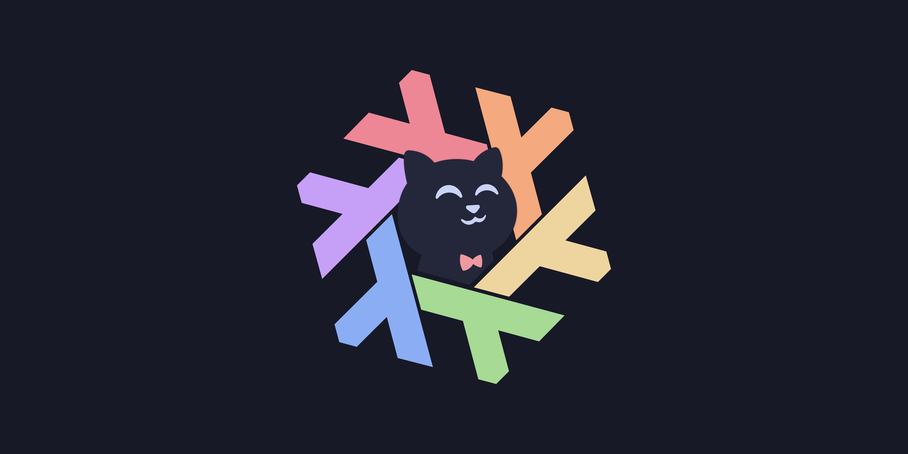

# nixdots

Personal NixOS configuration evolving into reproducible AI and workstation infrastructure.



This repository manages my desktop (`nixos-pc`) and laptop (`nixos-laptop`). It is public as a reference, not a drop-in distribution. The architecture also leaves room for an always-on VPS without making desktop settings the default for every machine.

## Highlights

- `nixos-unstable`, flake-parts and import-tree
- Dendritic feature modules: related NixOS and Home Manager configuration lives together
- Explicit role composition and host-specific hardware/display configuration
- Hyprland, Caelestia, Stylix and Catppuccin
- Development tools, Nixvim and Docker
- AI clients (Pi, Claude Code, Codex, OpenCode and Herdr)
- Shared agent skills, usable independently of the desktop
- Model-agnostic client installation, with opt-in local Ollama configuration for Pi, Codex and OpenCode

## Repository layout

```text
.
├── flake.nix                    # inputs and composition entrypoint
├── flake.lock                   # one lock for all dependencies, including skills
├── hosts/
│   ├── nixos-pc/                # host composition + generated hardware
│   └── nixos-laptop/
├── modules/
│   ├── core/                   # OS policy, locale and Home Manager
│   ├── shell/                  # CLI tools and Fish
│   ├── desktop/                # desktop session, theme, apps and media
│   ├── networking/             # network management, SSH, LocalSend and opt-in networks
│   ├── development/            # development environment
│   ├── ai/                     # clients, skills and inference
│   ├── hardware/               # reusable boot/GPU/power choices
│   ├── roles/                  # base and workstation bundles
│   ├── users/                  # personal identity, permissions and autologin
│   ├── checks.nix              # architecture, desktop-script and Lua checks
│   └── flake.nix               # supported systems and formatter
└── wallpaper/
```

`import-tree` discovers flake-parts modules in `modules/` and `hosts/`. Discovery **registers** features; it does not enable them. Files/directories prefixed with `_` are excluded, including generated hardware files.

See [Architecture and adding hosts](docs/architecture.md) for the composition model and examples, and [Scoped networking and access](docs/networking.md) for per-host SSH/VPN selection, campus Wi-Fi provisioning and Nix daemon policy.

## Using this repository

> [!IMPORTANT]
> This is my real machine configuration. Do not rebuild your system from it unchanged. Adapt hardware, users, secrets, device settings and security policy first.

### 1. Clone or fork

```bash
git clone https://github.com/ElliotLuque/nixdots.git
cd nixdots
```

### 2. Review the configuration

Start with `flake.nix`, `hosts/<name>/default.nix`, `modules/roles/` and `modules/users/elliot.nix`. There is no global username or implicit host factory.

```bash
nix flake show
nix flake check --no-build
nix build .#checks.x86_64-linux.architecture
```

The architecture check evaluates headless and workstation fixtures, standalone skills, and opt-in local-model configuration. The networking/access check verifies feature-scoped firewall rules, SSH selection, runtime campus credentials and identity-independent Nix access. `nix flake check` also builds desktop scripts and tests Hyprland host overrides with stub compositor calls. `nix flake check --no-build` evaluates both real NixOS configurations without building or activating either system.

### 3. Add your host

Follow [the host guide](docs/architecture.md#adding-a-host). Keep generated hardware in `_hardware-configuration.nix` so it is imported as a NixOS module, not automatically as a flake-parts module. New files must be Git-tracked for local Git-flake evaluation (`git add <files>`).

Review at least:

- hardware, bootloader, hostname and networking
- GPU and monitor configuration
- username, home directory and state versions
- packages, services and firewall exposure
- SSH authentication and secrets

### 4. Rebuild

```bash
sudo nixos-rebuild switch --flake .#nixos-pc
# or
sudo nixos-rebuild switch --flake .#nixos-laptop
```

The existing Fish `system-rebuild` shortcut is unchanged. See [Proposed rebuild improvements](docs/rebuilding.md) for options that preserve its convenience while adding clearer build output, action selection and future remote deployment.

## Image viewer

Swayimg is the default image viewer on both workstations. Home Manager installs it and writes `~/.config/swayimg/init.lua` from `programs.swayimg.initLua` in `modules/desktop/apps.nix`; image MIME defaults live in `modules/desktop/xdg.nix`. Change these Nix declarations rather than editing the generated Lua file.

Opening an image also loads neighboring images in natural filename order. Large images fit the window without enlarging small ones. Use **Page Up / Page Down** for previous/next image, **Enter** to toggle viewer/gallery, **f** for fullscreen, **t** for the information overlay, and **q** or **Escape** to quit.

## Reusing features

Features are exposed through `modules.nixos.<name>` and `modules.homeManager.<name>`. For example, another Home Manager configuration can import:

```nix
inputs.nixdots.modules.homeManager.agent-skills
```

This provides the same pinned skill sources and selection without importing a workstation, a personal user or Ollama. The old `agent-skills/` nested flake has been removed; its inputs and configuration now live in the root flake and `modules/ai/skills.nix`.

The base role intentionally includes both Vim and Neovim. Pi installs without model configuration. Hosts running local Ollama can apply `modules.homeManager.local-llm` to a managed user: model IDs and the endpoint come from `services.ollama`, not from the client installation modules. Currently only `nixos-pc` selects this feature. Use Pi's `/model`, `codex --profile local`, or `opencode --model ollama/<model-id>` to select local inference; cloud defaults remain unchanged.

Use `nix fmt -- <files>` for Nix formatting.

## Security

Never commit private keys or plaintext credentials. Report accidental credential exposure or security issues using [SECURITY.md](SECURITY.md), not a public issue containing sensitive details.

## Contributing and status

See [CONTRIBUTING.md](CONTRIBUTING.md). This is an actively used personal environment; upstream projects and modules evolve, and backwards compatibility is not guaranteed. A VPS is a future deployment, not a currently exposed host output.

## License

[MIT](LICENSE).
